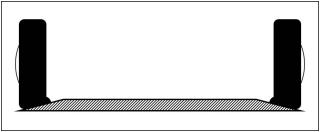
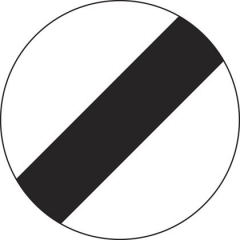

I've covered many different topics during (very nearly) 15 years of writing these columns, and I have tried not to repeat myself! Every so often, though, it seems a good idea to look back and revisit one or two things I've written about previously that are still at the front of my mind, as I drive...

What is the point of a speed cushion - especially, what's the purpose of laying a series of cushions (the square or rectangular sort) along a road? It must be to reduce the speed of the traffic. And if you steered either your left or your right wheels up and over a cushion, you would be rather foolish*not*to slow down. However, you will surely have noticed that the width of most cushions is roughly the same as that of your car, hence if you aim for them centrally you don't need to ease off at all. That's really why I ask: what's their point?

Some years ago, a picture suddenly came into my head of what must be happening to my tyres when I straddled a speed cushion in this way. I tried to describe it to you at the time, but now I think a diagram will make the message clearer. As you can see, each tyre (of the four) is being heavily compressed on its inner edge. And this will happen all round the circumference, rapidly and at least once, as I speed along the cushion.

 Except that I don't, not now! The thought of the possible long-term tyre damage soon made me switch to running my wheels over the tops of speed cushions, instead of straddling them. It occurred to me too that doing the latter (as illustrated) would have pushed the wheels apart and put some strain on the suspension and steering gear.

I realize that the tyres - two left or two right - still compress a bit when they hit the front slope of a cushion, but this is only local (and spread across the tyre too), and if I reduce speed enough the effect will be minimal anyway. No doubt the drivers behind me wonder why I am taking this slow and less comfortable line, but that's too bad. Perhaps I ought to check if tyres really do deform as much as shown above, by stopping my car in the straddle position and taking a look. How can they not be doing so, though?

As I write, the BBC seems to be in the middle of a season (unannounced) of programmes focusing on sleep. It's been good to hear them reinforcing several points that I have made in these pages over the years! For example, I've complained to you more than once about the disruption to my sleep twice a year caused by having to change from GMT to BST and back again.

In one of the programmes, sidestepping the perpetual argument about which time-setting results in fewer road accidents, someone claimed that the switch to BST at the end of March causes not only a spike in the accident rate each year, but also a 5% rise in heart attacks during the three weeks following.

Why do we inflict this on ourselves? Why can't we keep the clocks fixed to a time that gives the best general compromise between day and night through the year - and allow anyone who wants or needs to vary their routine from season to season to do so? Me, I would be happy with either GMT or BST, if only we stuck to it.

At the heart of the problem is our internal body clock. This evolved to detect and synchronize smoothly with dawn and dusk, but now we upset it in so many ways: changing the hour, travelling the world, living under artificial light, and staring at small bright screens just before heading for bed. This last habit can be seriously sleep-disrupting, apparently, and is probably damaging the educational progress of a whole generation of young people by tricking their body clocks into delaying the onset of sleep, reducing the amount of vital 'REM' sleep that they get, and generally making them less alert the next morning.

(Which reminds me of a report I saw, blaming smart-phones for some or all of a 6% rise in child-pedestrian casualties in a year. You could say that children need to be alert - and not glued to a screen - most of all when on their way to school.)

Shift workers rarely manage to reset their body clocks fully to their night-time schedule (so I learned from the BBC) because of all the daylight around the period when they are trying to sleep. Long-term consequences for them include higher risks of obesity, type 2 diabetes and cardio-vascular disease. As for the rest of us, if we are driving in the small hours when we would normally be asleep, then even though we may feel wide awake our capabilities are no better than if we had had a drink or two.

(Which reminds me of something else I've read: it only takes mild dehydration to make you perform as erratically on the road as if you were over the alcohol limit...)

 Ten years ago I started gently ranting about the absurdity of indicating the 'national speed limit' (which is 50, 60 or 70 mph depending on where you are and what you're driving) with a sign that was clearly designed to say*No Speed Limit*- more than 80 years ago. I also wondered how many drivers didn't know the limits (for cars). In 2012, one such turned up on BBC2's*Mastermind*! He was asked what the limit was on otherwise unsigned single-carriageway roads, and his answer was 70 mph (promptly corrected by John Humphreys to 60).

In the following year the full and appalling picture was revealed by the AA in a survey (which I somehow overlooked at the time): four out of ten motorists were unaware of the correct NSL figure for dual-carriageways, and an even larger fraction couldn't identify it for single-carriageway roads. As for motorways, 7% of drivers thought the speed limit on them was 80 mph. Admittedly, an 80 limit was being discussed publicly at the time. And as far as I know, the only 'announcement' of the NSL as you enter any motorway is the rectangular blue sign with the M-number and motorway symbol.

Anyway, given such levels of general ignorance of the national speed limit(s), surely it would be worth replacing all the signs that are supposed to be indicating it, or them, with actual numbers? (But not, I think, with speed cushions!)
