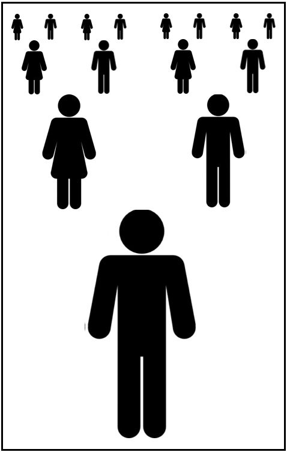

This is the 150th column I have started, would you believe, under my 'trademark' heading. In the fifteen years since the first one, I've offered you a large number of words: by my very rough estimate, it's 130,000 or more! Where did they all come from? Or rather, where did all the*ideas*originate? That I can't tell you. The brain works in a mysterious way, connecting different things that it picks up.

For example, ten years ago in this column I said I had found two large numbers relating to Great Britain in 2005: the total distance driven by motorized vehicles, and the total number of these that had met with accidents. And it had occurred to me to connect them, dividing one number by the other to produce a statistic I had never seen reported before, namely that*the 'average driver' (or vehicle) travels about 600,000 miles between accidents*. Of course this mythical motorist would need much longer than a year to cover the distance, but it is a measure of the overall accident risk, and I am wondering if the figure has changed much over a decade.

But there's a problem. I've found the mileage that was driven by all vehicles in 2015 (don't ask me how it was measured!): 315 billion miles, slightly more than ten years earlier. However, I can't track down the total of vehicles in accidents for the year (or any year). What is available now is data for*reported*accidents. In 2005 my figure must have included an estimate of the unreported ones, as it was more than a third higher than in the historic table I'm looking at. But this table holds good news: vehicles in reported accidents fell by 32% over the ten years. Can we say that the number in all accidents did the same?

Probably not, but if it did, then in 2015 perhaps around 340,000 vehicles met with an accident. Dividing this into 315 billion gives us now*over 900,000 miles\**driven per vehicle per accident*. However you define an accident, and even though the numbers are all approximate, this points to a surprising improvement since 2005. The main contributory factors, I guess, are rises in (a) the standard of driving, and (b) the quality of vehicle design and construction. Certainly not any improvements in the state of road surfaces!

This talk of big numbers reminds me of a different and quite remarkable idea, put into my head by Richard Dawkins, from his book*Unweaving the Rainbow*. He writes: "We are the lucky ones. Most people are never going to born. The potential people who could have been here in my place, but who will in fact never see the light of day, outnumber the sand grains of Arabia. We know this because the set of possible people allowed by our DNA so massively exceeds the set of actual people. In the teeth of these stupefying odds it is you and I, in our ordinariness, that are here." I should mention that I've omitted from this quotation a few words that could have made it less easy to follow.

I would now like to try rephrasing it in less theoretical terms (and more biologically, sorry!): at my conception, a sperm joined with an egg to start the development process that created a unique person. But at that moment, this might have been achieved by any one of (let's say) a million sperm crowding around, all differing in their DNA and therefore each poised to make a different individual, male or female. And if conception had occurred at another time (or in another month), the result would have been a different person again... This, I think, is a better way for us to begin to grasp the high chances against*me*being born, rather than someone else (out of millions) you never knew.

So as Professor Dawkins says, we are the lucky ones! He then gives us even more reason to think so: most conceptions quietly fail, early in gestation - though this hurdle only multiplies my own 'unlikelihood' by a relatively small factor. What lifts the chances against my own existence into astronomical numbers is the fact that my parents faced even more improbability than I did, first in being born themselves, and later in happening to meet and then pairing with each other. Furthermore, consider similarly my two pairs of grandparents, my eight great-grandparents...

 Is your head spinning? I shall now make it spin faster, by paraphrasing the next observation made by Richard Dawkins: if someone in the past had acted differently in a way that ultimately affected any one of my ancestors' conceptions, or their encounters, as I've described above, then I would not be here. If we look back far enough,*almost everything that anyone did*influenced whether or not I was going to be born. ("The humblest medieval peasant had only to sneeze," is how Professor Dawkins illustrates this!) And the same applies to you, and to everyone else.

Some individuals had an obvious effect. Take Edward Jenner (1749-1823), who pioneered vaccination: it's easy to see that if he had chanced not to be conceived and born, or if he had chosen a different line of work, some people of his time and later would not even have survived to become parents, hence many of*us*would not be alive now, and in our place there would be a quite different (and probably smaller) population. Our lives hang by threads indeed.

Let's not forget also that the threads intertwine. The whole of humanity today has ancestors in common, hence we're all cousins of each other the world over. To me the notion that we belong to a single family tree (hugely complicated though it may be) is as awe-inspiring as the previous idea that my birth happened against the unimaginably high odds that someone else would be brought to life instead.

I can't resist ending on a note of pure fantasy: I am trying to picture a world in which everyone has knowledge of some of these matters - our interrelatedness, or the sheer luck needed for each of us to have been born, or for that matter the wonders of evolution, of heredity and of development (from embryo to adult). In such a world, how could anyone contemplate or even want to risk taking the lives of others, whether in war, terrorism or crime (dangerous driving included!)? Hence my simplistic solution to many of the world's woes:_education, education, education_...
