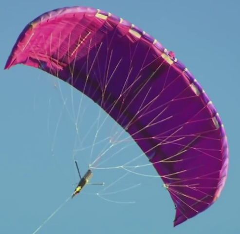
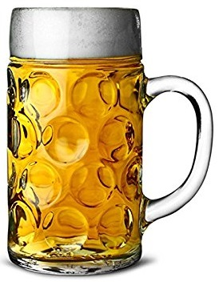

At the start of the summer I was thinking of filling this September column with a survey of silly-season stories, as I've sometimes done before. But instead, the season has produced an extraordinary stream of sensible, significant, and surprising stories - possibly enough to see me through to the end of the year!

Though a little silliness has appeared sometimes. Would you believe it: a review of the 'smart' section of the M25 between J23 and J27, which has had all-lane running for three years, said it was "notable that Lane 1 flows are much lower than the other lanes, indicating that drivers are less keen to use that lane."

Well, what on earth did the authorities expect? On any ordinary motorway, in my experience, Lane 1 is noticeably less occupied than the others whenever the traffic is between (let's guess) 25% and 75% of capacity - making it ideal for motorists like me who prefer a relaxed drive with a good long view ahead (remembering to beware of cars cutting across, as a junction approaches).

So on smart motorways, with the ever-present risk of a broken-down vehicle ahead of you in Lane 1, is it any surprise that even more drivers (38% in a recent survey) don't want to use it? I gather that the emergency lay-bys or refuges will soon be placed closer together than the current 1 miles separation, but will that increase the usage of Lane 1? I doubt it. I don't recall having driven on a smart motorway myself yet, but when I do I shall certainly think twice about sitting in this lane.

Hang on - something has prompted me to do a little research, from which I've now got the message that there are*different levels*of motorway smartness: Controlled (simply with a variable speed limit), Dynamic Hard Shoulder (meaning it's driven on at peak times), and All Lanes Running (no shoulder at all, as above). I've encountered the controlled sort often enough before, but I just hope I shall be smart enough to cope with the other two, when I find them...

 Within a few days of each other, I saw descriptions of striking new ways of first generating and then storing electricity. The first seems hardly credible: driving a ground-level dynamo with two large kites, which take it in turns to rise and pull (hard) on the rotating generator, and then to be hauled (gently) back down. The system is actually claimed to be competitive with a wind turbine, having the potential to generate 3 MW of power, and with lower construction and maintenance costs. This is especially so off-shore, and furthermore they can be based in deeper water than a wind turbine can.

The storage idea is flywheels - hardly a new invention, but now being developed to spin in a vacuum on frictionless magnetic bearings, taking surplus electricity (as rotational energy) from the national grid, holding it for days, and then rapidly returning it when needed. You might think that large lithium-ion batteries could be used for this purpose, and increasingly they are - but they can only take a certain number of charges and discharges. The flywheel backup units could last virtually for ever!

Will they save the grid, though, when everyone possesses electric cars and wants to fast-charge them? I've read that this will overload the network, at least locally. In favour of electrics, on the other hand, I have also seen a claim that they use no more juice (per mile) than is consumed now*just in refining*the equivalent petrol (per mile). Though whether these things are true, I can't say (yet)...

There were rather mixed messages for alcohol-imbibers through the summer. In June we were told that over time, even moderate drinking damages the brain and also increases the risk of cancer. However, only a week later came news that beer is good for you, fighting off fractures, kidney stones, cataracts, diabetes, strokes, heart attacks and Alzheimer's, and helping you to retain 'good' cholesterol.

 In July it was announced that having a drink (or two) just after you have undertaken a word-learning task, say, actually improves your later memory of the words - in proportion to the number of drinks. The explanation offered was that they dull your senses and allow the brain to transfer the words into long-term memory sooner than it would have done otherwise. More research is clearly needed, I say!

Also that month, we heard that moderate regular wine-drinking is a defence against developing diabetes, according to research in Denmark. Sadly, however, the NHS immediately dismissed this work as unreliable. But then in August we were informed that moderate to heavy (though not excessive) alcohol intake "by older adults" correlates with a longer life and a greater chance of avoiding dementia. Having digested this, I raised a glass and resolved to read no more on the topic.

But I did see some other surprising health news, about a possible breakthrough in obesity prevention. It's well known (so I read) that people who lose their sense of smell become thin: this is assumed to be because they eat less. But research on mice revealed that those who were deprived of their sense of smell either kept to normal weight or, if already obese, lost it - in contrast to their sniffling cousins -_when given the same amounts of high-fat high-calorie food_.

It seems that losing the ability to smell actually changed their metabolism, so that surplus fat was burnt away. The big question is: if a drug could be developed to suppress our own sense of smell temporarily, might we benefit similarly? (Dare I even suggest a use here for the humble clothes-peg?)

Something about that last subject reminds me that I noticed a report of a study into the growing habit of 'binge-watching' TV programmes. It revealed that compared with people who did this (sitting down to view all of a drama series in one go), those who saw the episodes week by week rated their enjoyment of them higher and, days or weeks later, recalled more about them. Is there an analogy here with chocolates? Much nicer to eat one a day than the whole box at once, I think!

Let's finish (for this month) with a pure silly-story from S Korea, where researchers tried a range of different car-horn noises on volunteers, hoping to identify the one that caused them the least stress. They finally settled on the quacking of a duck. So if, in the future, you hear such a noise approaching you rapidly from behind, be prepared to be struck by a rather larger object than you might have expected.
