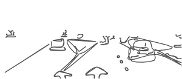
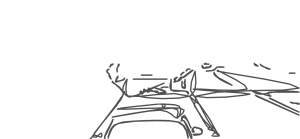
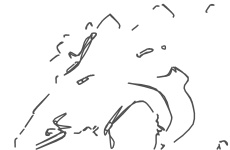
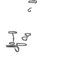
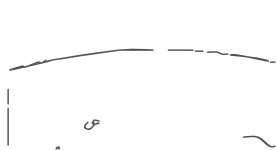

_March 2016_  

# The worst of motorways, the best of views of Earth from space

Motorists who live in and around Reading can, I guess, be divided roughly into three groups: (1) those who use our short (4 miles) A329(M) motorway to go east to Bracknell and beyond, (2) those who turn off it halfway along, on to the M4, and (3) those who hardly use the road at all. Recently it was extensively redesigned, in favour of the second group of drivers (aiming for the M4). Me, I used to join the first lot once or twice a week (to Bracknell), but now I avoid the A329(M) if I possibly can.

Normally the road is the responsibility of Wokingham Borough Council, but last year Highways England (formerly the Highways Agency) exercised their right to step in and modify not just the slip roads to and from the M4 at its J10, but also much of the length of our little motorway. The idea was to give drivers joining or leaving the M4 an easier run in peak periods. But the outcome has been bad for those travelling to and from Bracknell.

  

The two photos, courtesy of Google Street View, show what has changed on the Reading-bound A329(M), at its second exit to the M4. The difference is obvious: before, the slip-road peeled away from the inner lane, but now this lane is the exit-road! (And it's just the same on the opposite carriageway.)

As you can see too, there is now only one lane for straight-ahead traffic. Worse, effectively it runs for two miles, starting way back where you are first told to Get in Lane - that's left for the M4 (both exits) and right to continue on the A329(M) - and ending far beyond the intersection, where the nearly solid white line finally breaks up and you can 'safely' switch to the inner lane, newly arrived from the M4. Which is likely to be occupied by fast traffic...

So whereas motorists departing for, or arriving from, the M4 can usually keep up to speed in their lane, those pressing on for Reading (or going in the opposite direction for Bracknell) face real difficulties in the rush hour:

I've contacted Highways England (HE) about these problems several times. They admitted that our motorway is probably the only one in the country to have a significant single-lane stretch,  but they tried to argue that the congestion on it was due mainly to drivers changing lane late (see above), and that when people got used to the new A329(M) layout and treated it properly, 'free flow' should return.

Well, I haven't heard that this has happened yet! And later, under pressure from many parties (WBC and John Redwood MP included), HE accepted there were difficulties still, and listed further possible options such as reducing the speed limit, adding more signage and tweaking the lane alignment.

Some think that the road should also be downgraded to an A-road. But would carrying out any of these measures deal with the simple fact that the straight-ahead lane has to carry too much traffic in the rush hour - with the result that we now have two miles of road (in each direction) on most of which, dangerously, the inner lane is 'fast' and the outer one often 'slow'?

Our A329(M) has some other peculiarities too: it's not a section of the A329 as you might expect from the name, but runs parallel to it, so for consistency with other motorways the label should have been 'M329'. Also, its central reservation is the boundary between John Redwood's Wokingham constituency and Theresa May's Maidenhead one! And in the second photo above, the new white dividing-line between the lanes is picked out with green reflecting studs.

What's wrong with that? Well, green studs are meant to mark a "length of the edge of the carriageway which may be crossed" (such as where an inner lane feeds a slip-road or an additional lane). But surely the last thing that's wanted at this point, just as the two lanes are about to separate, is for drivers to be encouraged to make a last-second swerve from one to the other!

Changing the subject, if in January you enjoyed and even followed up my description of the amazing views being sent down all the time from cameras mounted on the outside of the International Space Station (to the internet),  let me tell you more. Firstly to remind you, the webpage is [eol.jsc.nasa.gov](http://eol.jsc.nasa.gov/HDEV) - and of course I don't mean "sent down all the time", but just over half the time, whenever the ISS (and the surface of the Earth under it) is being illuminated by the Sun.

Next, below is (I think) a wonderful image which I captured as the space station was passing over the Bahamas and transmitting images from the camera that's pointing straight down. The water is so clear that you notice all the 'land' below sea-level before you realize how little there is above it, forming the actual islands (rather in the manner of an iceberg). To appreciate this fully, you need to compare the picture with the map underneath - allowing for the angle-difference between them:

  

Annoyingly, a week or two after I observed the Bahamas, there appeared in front of the downward camera what looked like a scaffolding-strut, spoiling the picture by dividing it in two down the middle. On closer inspection, it was some sort of panel, seen almost edge on. Anyway, I sent an email to the HDEV website, gently complaining about the obstruction, and received a reply: "It's the Dragon solar array, which is scheduled to be undocked on 11 May." That's good, then! (I later discovered that the Dragon is a commercial spacecraft which usually remains docked to the space station for about a month at a time - so its solar panel may well show up again...)

Lastly, below is a forward view from the ISS in which you can see a foreshortened English Channel, with Cornwall just left of bottom centre, and the Channel Islands below the middle of the picture. (You would get more detailed images than I can reproduce here, of course, by looking at the HDEV webpage yourself and setting it to maximum resolution.)

STOP PRESS: on 9 May you could quite easily make a much longer-range space observation - given binoculars and a clear sky - namely seeing a transit of Mercury. It will cross the face of the Sun as a tiny dot, as I mentioned here last April. For the setting-up instructions in that column, click [April 2015](2015-04-deer-dodged-sun-projected-speed-regulated.md) , though I must repeat a nannyish warning: don't allow *your *face, or anyone's, near the eyepieces of the bionoculars while they are pointing sunwards.

The transit lasts from just after midday (BST) to nearly 7pm, so you might have a chance of observing some of it even if the weather is variable. Transits of Mercury occur only every eight years on average. The paradox is that it's rather easier to see this elusive planet in silhouette during a transit, than by the solar light that Mercury reflects at dawn or dusk any year, if it is at its furthest from the Sun (sideways), which is not very far!