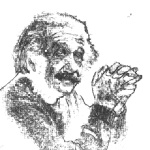

_February 2017_  

# Having second thoughts

It sometimes happens that researchers and inventors come to regret an idea or discovery or invention of theirs. The classic example (though perhaps 'modern' would be a better word!) is Albert Einstein, whose theories of relativity and equation *E* = *mc*2 first predicted and explained the colossal amounts of energy that could be released in nuclear reactions. Then in 1939 he co-signed a letter to US President Roosevelt urging him to support the development of nuclear weapons, for fear that Germany would otherwise achieve them first.

Later on, however, although Einstein can hardly have wished to turn the clock back on the previous great advances in physics that he had been responsible for, he strongly reproached himself for signing the letter to Roosevelt, which had been accepted and which led ultimately to the bombing of Japan: "Had I known the Germans would not succeed in producing an atomic bomb, I would have never lifted a finger."

(Just to explain, in *E* = *mc*2 the *m* represents the tiny fraction of mass that literally disappears and becomes energy *E *during nuclear *fusion*, when two hydrogen atoms merge to form helium. Likewise in *fission* when, for example, a uranium atom disintegrates into lesser elements. And *c* is the velocity of light - a large number, and even more so when squared! So if many atoms are involved in the reaction, much energy is released. Fusion is what keeps the Sun alight, and fission is what we use in nuclear power stations. Both processes have been employed in weaponry.)

At a lower but more widespread level of warfare, Alfred Nobel was the inventor of (among many other things) dynamite, which he hoped would make war so immediately and mutually destructive that no-one would want to wage it. But of course this didn't happen, and it's believed that his legacy, funding the annual series of prizes now awarded in his name, was an atonement for the invention. As for Mikhail Kalashnikov, he designed the AK-47 rifle in 1947, and for the remaining 65 years of his life he looked on in increasing horror at the lives that it took.

Let's turn away from military matters: the labradoodle (dog) was bred in the late 1980s by an Australian, Wally Conran, for someone who needed a guide-dog that wouldn't shed its hair (the reason being an allergy). But as this crossbreed became popular, he realized too late that it was not a healthy animal. He now warns against creating such combinations at random without careful forethought.

Certain people regret trivial inventions of theirs relating to computers: Scott Fahlman wanted to show in a message that he was only joking, and so he typed a simple emoticon, :-), apparently the first person to think of doing so. It now exists in a thousand different forms (mostly yellow, for some reason). Recently he said: "Sometimes I feel like Dr Frankenstein - my creature started as benign, but it's gone places I don't approve of."

Ethan Zuckerman devised the pop-up advertisement, and has since cursed himself and been cursed by others for it. And Tim Berners-Lee, who brought us the worldwide web, now wishes he hadn't incorporated the tedious double-slash (//) into the start of web-addresses, quite unnecessarily as he admitted later.

(Let me reveal a tenuous personal link here. I recently got back in touch with a fellow university student, Chris Jones. He told me that he had been Tim B-L's group-leader at CERN in Geneva in the early 1990s, when they took the decision, against some opposition, to remove the copyright from the program-code that Tim had written for labelling, displaying and browsing for 'pages' stored on the CERN computers. Thus the whole world-internet of connected computers, which already existed, was able to become a network for storing and sharing and finding information of every sort. Including these columns!)

I wonder if you have guessed where this train of thought might be taking us: last year I came across an article by Roger McKinlay, one of a team who in the 1980s was developing a satellite-navigation system - something that many drivers now use daily, calling it sat-nav. He didn't go quite as far as to say that he wished the team hadn't succeeded in its aim, but he did issue a double warning. Firstly, digital navigation does not come free: the US has invested more than $10 billion in GPS satellites, and spends $1 billion a year maintaining the service (which, he might have mentioned, could fail and let us down at any time without warning.)

Secondly, if we do not cherish our inborn navigational abilities, they will deteriorate: it's a clear case of *use it or lose it*. And of course, we already regularly hear tales of drivers who have blindly followed sat-nav instructions and ended up in cul-de-sacs or rivers, or have simply driven hundreds of miles in the wrong direction. How extraordinary that common sense has gone out of the window, that warning signs and even closed gates are ignored, and that when a map is to hand it is never checked. Misspell the name of a town as you punch it in, or overlook the fact that there are two places with the same spelling, and you're likely to go far astray!

(I have to admit that on the occasions when I'm a passenger in a car that's fitted with sat-nav, I find it difficult to take my eyes off the screen, with all the information being displaying about the road ahead. And when I do look up, often it's just to check and even marvel at how closely the terrain is matching the display - when in reality the clever thing is that the display is matching the terrain. Anyway, to my mind, sat-nav is potentially not just misleading for drivers, but also a visual distraction.)

Computers can easily select the apparently shortest or fastest path from A to B, but humans are better at choosing the *best* route. Though for how much longer, if most people's capabilities seem to be decreasing? What indeed if there is no driver in the car, lorry or ship (yes, the latest proposal is for fleets of unmanned vessels to be crossing the oceans)? And in all these situations, how to guard against errors that may have crept into the system, in positioning or in mapping or in working out the route?

Roger McKinlay's solution, as set out in his article, was in several parts: make this 'system' more robust and resistant to errors. Study how people interact with navigational aids and why they misunderstand them. Teach navigation and map-reading in schools, as life-skills. In other words, aim to get motorists back in charge of their own journeys!