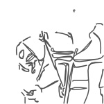

_July 2017_  

# Remembering, forgetting, and being distracted

I'm trying to recall where and when, recently, I saw a report of a scientific investigation - one that I vaguely remember seemed like encouraging news for everyone, though I can't think what exactly. Perhaps I read it in my daily paper. Let's rummage through the pile... Ah, here it is, at the top of the front page no less, last week. How could it have slipped my mind? Fortunately, the headline tells me not to worry over this: "Forget about memory lapses, they're good for your brain."

Underneath is a tantalizingly brief account of the research, so I've now looked it up online for more detail. Neuroscientists have always assumed that an inability to remember things amounted to a failure of the brain's methods of storing and retrieving information (as it plainly is, in sad circumstances like dementia). Now, however, they have observed 'mechanisms' in the brain that appear to be designed to erase some of its memories (even though it *ought *to have the capacity to remember everything that ever happened to us!). But what could be the benefit for us in this?

One suggested advantage is that when you are trying to reach a decision about something ("what to do now?"), you have a more manageable number of potentially relevant memories that need to be considered ("what happened before?"). Another is that because the memories we've retained have lost some of their detail, they are now more useful for applying to varied situations. And apparently, the subconscious brain is usually rather good at deciding which are the *unimportant* memories and details - so that they can then be quietly suppressed, leaving us with the helpful ones...

I see driving as a good example of an area where this forgetting-process seems to work well. Suppose you're arriving at a large, complex and busy roundabout. Consciously you apply all the rules: check the signs, decide whether to indicate, get into the right lane and gear, try to maintain some momentum, look for a safe gap, watch out for lunatic drivers.

But subconsciously you're also drawing on your vast previous experience of big roundabouts. Except that it's much too vast and so it has already been reduced, by the selective forgetting, to just a few generalized memories of gyratories, for helping you through and round this one. Anyhow, that is how I interpret the new research!

Also, I think it has an interesting parallel with something else I've described in this column several times: the brain's habit of ignoring incoming visual information if it judges it to be low-priority or irrelevant. This is absolutely necessary, in fact, because of how much you take in with your eyes - much more detail than the subconcious brain can possibly analyse (a necessary first stage, which you are quite unaware of) and then 'show you' in the time available.

Here then we have *instant* deleting of unwanted information (compared with the slow forgetting we were looking at above). This is clever brainwork, as long as we can rely on the decisions on what's unwanted being correct! Imagine you're back at that busy roundabout: you know the important things are the vehicles already on it and the ones alongside you, and so that's all your brain will bring to your attention, not the flowers in the middle of the roundabout, or the scenery beyond, or the clouds above or anything else. The big danger comes when a car is partly hidden behind a door pillar, because if its 'visible' bits are not successfully identified (and linked together) by your subconscious brain, then you literally will not see it.

How can you guard against this? I would say: only by *thinking door-pillar* all the time - just as you should be *thinking bike* (both the pedal and the motor varieties). Then with any luck, such hazards will be recognized within your industrious brain, and so will immediately register with you consciously. What I'm saying is that you do have at least some influence on your subconscious, if you think hard enough!

But the reverse happens much more, of course: I mean when your subconscious influences you. By coincidence, I've just come across another investigation into 'forgetting' things. The experiment was simple: 500 students were made to do a set of mental tasks requiring concentration, in one of three different situations, (A) with their smartphone on the desk (face down and silent), (B) with it out of sight in a pocket or a bag, and (C) with it left in another room.

The results? The students in Group A performed significantly worse (which in statistics means 'definitely' so, by the way, rather than 'very much') at the tasks than those in Group B, *which in turn did significantly less well than Group C*. And this even though a majority in each of the three groups said afterwards (when asked) that the placing of their phone hadn't affected their performance, nor had they even thought about it while working.

But the scores gave the game away! The A and B students may or may not have been deliberately trying to forget their phones nearby, though let's allow that many of them were not consciously aware of the devices. But simply because they were within reach, visible or not, the subconscious act of ignoring them was itself a distraction.

Now, as with the first research project above, isn't there a fairly obvious relevance to driving? You are in your car, with your smartphone switched so that it won't trouble you - and yet just the fact that it is with you could be reducing your concentration on the road ahead all the time, probably not by much, but maybe enough to make a difference in a critical situation. Even more than I did before (see my column last November) do I *not* want to own one of these small screens...

More old news from my paper, to end with: I read a while ago that the Princess Royal and her husband suffered a broken fanbelt, not on a road vehicle but on their £m yacht off the Hebrides. They were almost becalmed, but they managed to tack across to the Isle of Eigg, and then waited for a fanbelt (one actually made for an Astra) to be ferried in from many miles away.

What, not even a stocking or something similar available, to substitute for the belt in the time-honoured way? I was more impressed by the riposte from a reader: he said *he* once had to drive his Reliant Regal all the way from London to Portsmouth with a dog-lead fed out through the window and round to the carburettor, in place of a snapped accelerator cable!