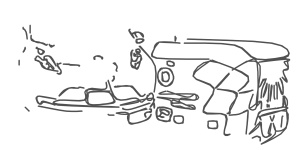

_February 2018_  

# The future of charging, the ease of lifting, a substitute for phoning

Looking back at my recent columns, I notice several topics that need updating! Let's start with electric cars (which I discussed only last month): I mentioned that public charging points for them would become more common. Naturally I was thinking of fixed terminals that you need to drive up to (probably having queued for a while). But now I've seen news of *mobile* charging units, to be imported from the United States by BP and installed on its forecourts for testing.

Except that being mobile, they won't need to be installed - hence there will some cost-saving (for BP) from the start. And not only can the charger be wheeled across to your car, but it could also be moved to another site, or even to a vehicle that has run out of juice on the road.

The charger is itself battery-powered of course, and is normally recharged from the mains overnight. It's then capable, during the day, of giving a decent fast-charge to about half a dozen cars (or more, if it can be kept connected to the mains by a suitably long lead for some or all of the day).

The National Grid should be in favour of this (fairly new) piece of equipment, as it will reduce the 'spikes' in demand from electric cars being fast-charged directly from the mains. And there's another technical benefit: the batteries in the charger are lithium cast-offs (from cars) that have lost some of their capacity but are still capable of doing this stationary job!

It would be feasible for any business with a staff car-park to invest in some mobile chargers, detailing off an employee to manage them. Though this points to the main uncertainty about their future everywhere: will the cost of an attendant's time outweigh the savings from convenience of installation and use?

By coincidence, on the newspaper page where I first read about mobile chargers was a report of a project to make use of those electric vehicles that *are *plugged directly into a mains charging-point. Focusing first on firms with electric fleets, the idea is to use their batteries as storage for the National Grid.

A big problem for the grid has always been how to balance supply and demand, in the absence of any sizeable storage capacity. But with thousands (and soon millions) of vehicle batteries being plugged in for charging, why not employ them at the same time for supporting the grid when, say, wind and sun power are in short supply? All that's required is a control system to ensure that each battery still ends up fully charged - and an inverter-box, like the one that's fed by the solar panels on your roof for changing their DC output to AC.

Which reminds me that last year I saw a different application suggested for cast-off car batteries that still have some life in them: install them at home to store surplus energy from your roof, instead of feeding it to the grid (and back again). This may not be cheap to set up, and I believe the batteries can be a slight fire risk - but there will soon be a growing mountain of them needing to be put to good use in one way or another.

In my October column I described another American product: the EksoVest, which I have since learnt is to be launched in the UK next month. It's a strap-on, upper-body contraption designed to add strength to the arms of construction and assembly-line workers. Weighing less than 5 kg, it is spring-loaded and entirely self-contained.

My concern was that it doesn't support the hands, and so you might think that they would have to work even harder than without the Eksovest (as the wearer would be encouraged to pick up and use heavier tools). However, I read later that this kit has already being tried successfully on Ford production lines in the US, with no mention of hand-strain, so maybe it's not a problem.

But I can definitely see something to worry about in the news of a more powerful design of 'exoskeleton' that is being developed for American soldiers by Lockheed: this version is battery-powered, weighs 12 kg and fits the body from the waist down - boosting leg-power by "up to 27 times" when, for example, heavy loads need to be carried uphill.

A British expert was quoted as saying that there was also "huge potential for the UK military." One imagines our brave lads clanking over hilly terrain a bit like the Martians in *War of the Worlds*. But suppose that halfway up a long slope they pause to check their kit... and find that the batteries are almost flat. What are they supposed to do then: phone the BP Forecourt Airborne Recharging Service?

Lastly, you may recall that I've discussed smart-phones several times recently. Perish the thought that I was deliberately presenting arguments to justify my reluctance to acquire one of these small screens myself! But anyone can see that their addictiveness (for drivers, cyclists and pedestrians) causes accidents and near-misses, and that their users, whether indoors or out, are effectively cut off from their surroundings.

Even when your phone is silenced and face-down or right out of sight (but nearby) there's evidence, as I reported last July, that its presence can distract you from focusing on tricky tasks. Among which, who can deny, is motoring...

Adding to this picture, near the end of last year the results were published of a survey of 1700 professionals: 62% said they felt anxious when not connected to wi-fi - and 72% admitted checking their smart-phone from the toilet, 11% at a funeral, and 7% during sex (it's not clear if both partners customarily check at the same time).

But help is at hand, literally, because in the same week came news of the Substitute Phone, which comes as a range of phone-sized blocks of plastic featuring a row of beads, at a choice of angles (diagonal is illustrated).

It seems that running your fingers along the beads, as you would in swiping or zooming in or out on a little screen, acts as therapy to keep you calm when you are parted from the real thing. But I strongly suggest you don't pick up even the substitute while driving!